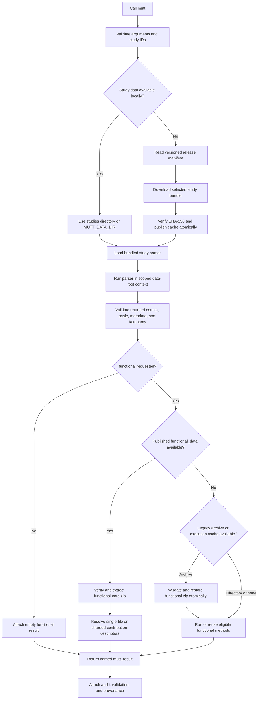

# MUTT: <span style="color: green;">M</span>icrobiome analysis <span style="color: green;">U</span>tilizing <span style="color: green;">T</span>otal <span style="color: green;">T</span>axa

MUTT is an R package and data API for microbiome studies that pair sequence-count data with measurements of total microbial abundance. Its only exported function is `mutt()`.

The package contains the parsing and validation code. Large study files remain in Git LFS under `studies/` or, after publication, are downloaded as checksum-verified study bundles into the R user-data directory. Docker contains the software environment but never embeds the study data.

## Install for development

Clone the repository with Git LFS and install the package:

```bash
git lfs install
git clone https://github.com/Silverman-Lab/mutt.git
cd mutt
git lfs pull
R CMD INSTALL .
```

## Study registry and repository conventions

The study registry is maintained here: [study sheet](https://docs.google.com/spreadsheets/d/13b4Toscse0MjyAGYt1zfWoPxSRpyuvENHVGKBLYwAAw/edit?usp=sharing)

It is the working list for study names, metadata, and repository decisions. Use it as the canonical reference when adding a new dataset or checking whether a study already exists in MUTT.

The repository conventions are:

- Use Git LFS for large files: https://docs.github.com/en/repositories/working-with-files/managing-large-files/configuring-git-large-file-storage
- Each dataset gets its own directory with an informative name, all lower-case, using the pattern `year_name_journal_keyword`.
- Be concise, but not vague. Do not use a year range like `2020-2024` when a single study year is enough.
- Compress datasets before uploading, and store the archive with Git LFS. The helper script `./zip-push-gitlfs.sh` handles that workflow from the repository root.
- Study parsers should use file paths relative to the root `mutt` directory.
- Large shotgun metagenomic tables are kept as processed data tables in this repository rather than as raw uploads.

The parsed data structure for each study should remain easy to inspect:

- `counts`: integer count table, with sample IDs as rows and taxa or sequence IDs as columns.
- `proportions`: real-valued abundance table with the same row and column alignment as `counts`.
- `scale`: positive-valued measurement table for total microbial abundance or a related scale variable.
- `metadata`: sample-level covariate table.
- `tax`: taxonomy table linking sequence IDs to classified labels and, when available, raw sequence strings.
- `phylo`: optional phylogenetic tree when a study provides one.

New study-data files must be stored as one-file ZIP archives so the existing `*.zip` Git LFS rule applies. Preview an explicit archive operation first, then apply it:

```bash
./zip-push-gitlfs.sh studies/STUDY/data.tsv
./zip-push-gitlfs.sh --apply studies/STUDY/data.tsv
git add studies/STUDY/data.tsv.zip
git lfs status
```

The archiver accepts only explicit paths under `studies/`, validates that each archive reproduces its input byte-for-byte, and refuses to overwrite archives unless `--replace` is explicit. It does not change remotes, stage unrelated files, commit, or push.

Legacy functional cache archives can still be refreshed without removing the working cache:

```bash
./zip-push-gitlfs.sh --apply --keep-source --replace \
  studies/STUDY/functional
git add studies/STUDY/functional.zip
```

When `functional/` is absent and `functional.zip` is present, `mutt()` restores the archive atomically before checking its cache. Cached PICRUSt2 paths are rebased to the current checkout, so stratified outputs remain readable after a clone or move.

New functional releases separate the complete execution cache from the
API-facing publication:

- `studies/STUDY/functional/` retains inputs, raw outputs, intermediates, and
  logs needed for diagnosis or revalidation. It is not published as one Git
  LFS archive.
- `studies/STUDY/functional_data/` contains validated final tables, ASV
  mappings, taxonomy, reconciliation records, provenance, checksums, and a
  versioned publication manifest.

The publication does not duplicate PICRUSt2 input FASTA/BIOM files or raw
intermediates. Those stay in the execution cache; the original counts,
sequences, and taxonomy stay in the study directory.

Maintainers and the HPC finalizer build the publication from an existing
validated cache with:

```bash
Rscript scripts/build_functional_bundle.R \
  --study-dir studies/STUDY \
  --max-asset-bytes 1900000000
```

The resulting `functional_data/` directory contains:

- `functional-core.zip`: compact result objects, manifests, mappings,
  taxonomy, reconciliation records, and provenance;
- `bundle_manifest.json`: checksums, sizes, roles, and paths for the core and
  every contribution asset;
- separately published EC, KO, and MetaCyc contribution tables.

Contribution files below the limit remain single gzip files. Oversized
contribution tables become independently usable gzip shards, and an oversized
`result.rds` is represented by reconstructable RDS components inside the core.
The HPC finalizer stages the core and contribution assets through Git LFS. The
complete execution cache remains unchanged. Legacy loose `functional_data/`
publications and `functional.zip` archives remain readable.

MUTT does not create a study-wide monolithic functional RDS. That would make a
single large table expensive to download and load. The publication manifest is
the stable logical interface: physical files may be single assets or shards,
while `mutt()` returns the same branch structure in either case.

## Use the API

Parse one local study:

```r
library(mutt)

x <- mutt(
  studies = "2021_vandeputte_naturecommunications_flow_timeseries",
  base_directory = "/path/to/mutt"
)
```

`base_directory` may be the repository root or its `studies/` directory. When omitted, MUTT checks `MUTT_DATA_DIR`, `./studies`, and its versioned user cache.

Run or reuse functional inference:

```r
x <- mutt(
  studies = "2022_cvandevelde_ismecommunications_culturedflowhumanfecal",
  functional = TRUE
)
```

Use `functional = "REBUILD"` only when eligible functional results must be recomputed. Use `functional = "REVALIDATE"` to require retained raw PICRUSt2 output and rebuild validated MUTT results without launching PICRUSt2. Functional outputs are stored under the selected study's `functional/` directory. `MUTT_FUNCTIONAL_PROCESSES` can override automatic PICRUSt2 worker detection.

When `functional_data/` is present, `functional = TRUE` verifies and extracts
the small core into MUTT's user cache, then reads contribution assets directly
from their single-file or sharded publication. It does this before inspecting
external tools or execution caches.

## Returned object

The result remains a named list, so existing indexing continues to work:

```r
names(x)
x[[1]]$counts
x[[1]]$proportions
x[[1]]$scale
x[[1]]$metadata
x[[1]]$tax
x[[1]][["function"]]$picrust2
x[[1]][["function"]]$faprotax
```

Each requested study also receives an auditable status record:

```r
attr(x, "audit")
attr(x, "provenance")
attr(x, "validation")
```

If one parser fails, successful studies remain available and the error is recorded in the audit. PICRUSt2 stratified contribution branches are file-backed; use the base `as.data.frame()` generic on a returned branch and specify `type = "ec"`, `"ko"`, or `"metacyc_abundance"`.

The same API works for a single contribution file or many shards:

```r
branch <- x[[1]][["function"]]$picrust2$asv

selected <- as.data.frame(
  branch,
  type = "ko",
  samples = c("sample_1", "sample_2"),
  functions = c("K00001", "K00002"),
  n_max = 100000
)

complete <- as.data.frame(
  branch,
  type = "ko",
  collect_all = TRUE
)
```

`as.data.frame()` accepts the same `type`, `samples`, `functions`, `asvs`,
`n_max`, and `collect_all` arguments. Reading a complete sharded table must be
explicit; MUTT does not silently reconstruct it.

## Processing flow



MUTT does not rarefy, add pseudocounts, close compositions, or log-transform counts during functional inference.

PICRUSt2 requires amplicon count, sequence, and taxonomy ASV identifiers to align. MUTT checks both sequence orientations, uses PICRUSt2's 0.8 minimum alignment threshold, requests coverage and `--stratified` outputs, and retains EC, KO, MetaCyc, NSTI, ASV mapping, taxonomy, and provenance records. If PICRUSt2 omits input samples after ASV placement/filtering, MUTT restores those samples as zero-prediction rows and records every retained and zero-filled sample in `sample_reconciliation` and `sample_reconciliation.tsv`. Unexpected or renamed sample IDs remain a hard error, and raw outputs are retained for diagnosis.

FAPROTAX receives classified amplicon taxonomic abundance tables with formatted lineages. MUTT uses counts whenever that branch has counts and falls back to its proportions only when counts are unavailable. Functional groups can overlap and are ecological annotations rather than directly observed genes.

Functional eligibility is method- and assay-specific. PICRUSt2 requires amplicon ASV-level counts and matching ASV sequences. FAPROTAX requires a branch explicitly identified as amplicon data, classified taxa, and a corresponding abundance table. Shotgun/metagenomic branches are recorded as skipped for both methods until a metagenomic functional workflow is implemented; branches whose modality cannot be established are also skipped rather than guessed.

## Docker

Build the software image:

```bash
docker build -t mutt:0.1.0 .
```

Run with a local LFS checkout mounted read/write:

```bash
docker run --rm -it \
  --user "$(id -u):$(id -g)" \
  -v "$PWD/studies:/data/studies" \
  -e MUTT_DATA_DIR=/data/studies \
  mutt:0.1.0
```

For rootless Podman, add `--userns=keep-id`. Mapping the host UID/GID is required when functional caches should be written back to the mounted study directories.

The image provides R 4.5.3, Python 3.12.13, PICRUSt2 2.6.3, FAPROTAX 1.2.12, and parser dependencies. The release image is tested locally with Podman and rebuilt in GitHub Actions.

Main-branch builds are also published to `ghcr.io/silverman-lab/mutt:latest`. On an HPC system with Apptainer:

```bash
apptainer build mutt.sif docker://ghcr.io/silverman-lab/mutt:latest
apptainer exec --bind "$PWD:/work" --pwd /work mutt.sif \
  Rscript --vanilla -e 'library(mutt); print(getNamespaceExports("mutt"))'
```

The image contains software only. Study data and functional caches are supplied through bind-mounted Git LFS checkouts.

## Data releases

Remote study downloads are disabled until a release asset has a fixed URL, archive size, SHA-256, and documented redistribution status in `inst/extdata/studies.json`. 

Current release state: all 57 local study directories and all 57 bundled parsers are present, but 0 of 57 studies have a verified redistribution decision and 0 of 57 production remote assets are enabled. The remote download, checksum rejection, extraction, and cache path are tested with local release fixtures; production HTTPS download remains intentionally unavailable until the release workflow below is completed.

The pre-restructure validation artifact contains 33 successful study outputs generated with sample alignment enabled. Compatibility checks for that set use `align_samples = TRUE`; the separate default-mode audit uses `align_samples = FALSE`. Failures outside the 33-study historical-success set are not treated as restructuring regressions.

Check all registered study directories, parsers, and redistribution decisions without writing archives:

```bash
Rscript scripts/build_study_release.R --all --check-only
```

After every study has documented redistribution evidence and its manifest status is `verified`, the complete staged release can be rebuilt with:

```bash
Rscript scripts/build_study_release.R --all
```

The builder stops before writing anything if any selected study is missing, lacks a parser, or is not redistribution-verified. It creates one ZIP per study, `release-assets.json`, and `studies.candidate.json`. The candidate manifest contains checksums and sizes but must not replace the package manifest yet.

Authenticate and upload the staged files as release `data-v2026.07.1`:

```bash
gh auth login -h github.com
gh release create data-v2026.07.1 release/data-v2026.07.1/*.zip \
  --repo Silverman-Lab/mutt \
  --title "MUTT data 2026.07.1" \
  --notes "Checksum-verified study bundles for MUTT 0.1.0.9000."
```

Finally, download every published asset, verify its size, SHA-256, and archive layout, and only then promote the manifest:

```bash
Rscript scripts/verify_data_release.R \
  --manifest release/data-v2026.07.1/studies.candidate.json \
  --remote \
  --promote-to inst/extdata/studies.json
```

The release builder refuses to overwrite a nonempty staging directory. The verifier processes remote archives sequentially, so it does not hold the full release in memory or retain a second complete downloaded copy.

## Development checks

```bash
Rscript --vanilla -e 'devtools::test()'
R CMD build .
R CMD check --as-cran mutt_*.tar.gz
```

Routine tests use tiny fixtures and fake external tools. The completed real 3-sample by 3-ASV PICRUSt2 smoke test is not repeated in routine CI because it required approximately 30 minutes.
